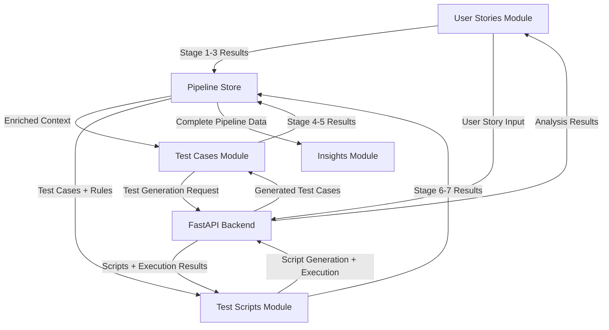

# Implementation Plan: Multi-Stage QA Pipeline Integration

## Goal
Integrate the 7-stage QA pipeline from the backend FastAPI service into the existing Next.js test automation platform, organizing stages across three main modules:
- **User Stories Module**: Stages 1-3 (Testability, Rule Grounding, Ambiguity)
- **Test Cases Module**: Stages 4-5 (Test Generation, DOM Mapping)
- **Test Scripts Module**: Stages 6-7 (Script Generation, Execution)

---

## Architecture Overview

### Current State
The application has:
- ✅ Next.js 16 with App Router
- ✅ TypeScript support
- ✅ Tailwind CSS + Radix UI components
- ✅ Three main modules: User Stories, Test Cases, Test Scripts
- ✅ Basic CRUD operations with mock data

### Target State
Enhanced application with:
- 🎯 Full 7-stage pipeline integration
- 🎯 Backend API connectivity (FastAPI at `http://localhost:8000`)
- 🎯 Real-time execution via WebSocket
- 🎯 Cross-module traceability
- 🎯 State management with Zustand
- 🎯 Progressive workflow from requirements → execution

---

## Proposed Changes

### Phase 1: Foundation & Infrastructure

#### [NEW] [lib/types/pipeline.ts](file:///d:/VSCODE/ai-test-automation-platform/lib/types/pipeline.ts)
Complete TypeScript type definitions for all API models:
- Stage 1: `TestabilityInsight`, `UserStoryInput`
- Stage 2: `RuleAuditResult`, `RequirementRefinementResult`
- Stage 3: `AmbiguityClassification`, `ClarificationItem`
- Stage 4: `TestScenarios`, `TestCase`
- Stage 5: DOM mapping types
- Stage 6: `PlaywrightScripts`, `PlaywrightTest`
- Stage 7: `ExecutionResults`, `TestExecutionResult`

#### [NEW] [lib/api/client.ts](file:///d:/VSCODE/ai-test-automation-platform/lib/api/client.ts)
API client with methods for all 7 stages:
```typescript
export const api = {
  analyzeTestability: (data: UserStoryInput) => Promise<TestabilityInsight>
  analyzeRuleGrounding: (data: RuleGroundingInput) => Promise<RuleAuditResult>
  classifyAmbiguities: (data: AmbiguityClassificationInput) => Promise<AmbiguityClassification>
  generateTestCases: (data: TestCaseGenerationInput) => Promise<TestScenarios>
  generatePlaywright: (data: PlaywrightGenerationInput) => Promise<PlaywrightScripts>
  executeTests: (data: ExecuteTestsInput) => Promise<ExecutionResults>
  refineRequirements: (data: RequirementRefinementInput) => Promise<RequirementRefinementResult>
  health: () => Promise<HealthStatus>
}
```

#### [NEW] [lib/api/websocket.ts](file:///d:/VSCODE/ai-test-automation-platform/lib/api/websocket.ts)
WebSocket client for Stage 7 real-time execution:
```typescript
export const createTestExecutionWebSocket = (
  scripts: PlaywrightTest[],
  baseUrl: string,
  callbacks: {
    onMessage: (data: any) => void
    onComplete: (result: ExecutionResults) => void
    onError: (error: string) => void
  }
) => WebSocket
```

#### [NEW] [lib/store/pipelineStore.ts](file:///d:/VSCODE/ai-test-automation-platform/lib/store/pipelineStore.ts)
Zustand store for global pipeline state:
```typescript
interface PipelineState {
  currentStage: number
  enrichedContext: string
  stage1Result: TestabilityInsight | null
  stage2Result: RuleAuditResult | null
  stage3Result: AmbiguityClassification | null
  stage4Result: TestScenarios | null
  stage6Result: PlaywrightScripts | null
  stage7Result: ExecutionResults | null
  // Actions
  setStageResult: (stage: number, result: any) => void
  resetPipeline: () => void
}
```

---

### Phase 2: Shared Components

#### [NEW] [components/shared/status-badge.tsx](file:///d:/VSCODE/ai-test-automation-platform/components/shared/status-badge.tsx)
Reusable status indicator with color coding:
- `completed` → Green
- `current` → Yellow with pulse animation
- `pending` → Gray
- `blocked` → Red

#### [NEW] [components/shared/metric-card.tsx](file:///d:/VSCODE/ai-test-automation-platform/components/shared/metric-card.tsx)
Display key metrics with icons and color coding

#### [NEW] [components/shared/expandable-card.tsx](file:///d:/VSCODE/ai-test-automation-platform/components/shared/expandable-card.tsx)
Collapsible content container using Radix Accordion

#### [NEW] [components/shared/code-viewer.tsx](file:///d:/VSCODE/ai-test-automation-platform/components/shared/code-viewer.tsx)
Syntax-highlighted code display with copy functionality

#### [NEW] [components/shared/workflow-visualization.tsx](file:///d:/VSCODE/ai-test-automation-platform/components/shared/workflow-visualization.tsx)
Visual progress indicator showing all 7 stages with current position

---

### Phase 3: User Stories Module (Stages 1-3)

#### [NEW] [components/stages/stage1/user-story-input.tsx](file:///d:/VSCODE/ai-test-automation-platform/components/stages/stage1/user-story-input.tsx)
Form component for entering user story details:
- User story text area (required)
- Detailed description (optional)
- Acceptance criteria (optional)
- Submit button with loading state
- Calls `/api/v1/analyze`

#### [NEW] [components/stages/stage1/testability-results.tsx](file:///d:/VSCODE/ai-test-automation-platform/components/stages/stage1/testability-results.tsx)
Display Stage 1 analysis results:
- Status badge (Test-Ready vs Blocked)
- Tabbed interface:
  - Behaviors tab
  - Checklist tab (expandable cards)
  - Assumptions tab
  - Questions tab
- Download JSON button

#### [NEW] [components/stages/stage2/rule-grounding-analysis.tsx](file:///d:/VSCODE/ai-test-automation-platform/components/stages/stage2/rule-grounding-analysis.tsx)
Display and interact with rule grounding:
- Run Stage 2 button
- Status indicator
- Tabbed sections:
  - Explicit Rules
  - Completeness evaluation table
  - Gaps & Conflicts
  - Clarification questions

#### [NEW] [components/stages/stage2/requirement-refinement.tsx](file:///d:/VSCODE/ai-test-automation-platform/components/stages/stage2/requirement-refinement.tsx)
Answer clarification questions:
- Question display with numbering
- Text area for each answer
- "Refine & Re-run Stage 2" button
- Iteration counter

#### [NEW] [components/stages/stage3/ambiguity-classification.tsx](file:///d:/VSCODE/ai-test-automation-platform/components/stages/stage3/ambiguity-classification.tsx)
Categorize and resolve ambiguities:
- Summary metrics cards
- Data table with clarification items
- Grouped view by resolution owner
- Answer input for each item
- "Update Context & Proceed" button

#### [MODIFY] [components/modules/user-stories.tsx](file:///d:/VSCODE/ai-test-automation-platform/components/modules/user-stories.tsx)
Integrate Stages 1-3 into expanded user story view:
- Add "Pipeline Stages" section in expanded details
- Show Stage 1-3 components in tabs or accordion
- Track stage completion status per user story
- Add "Start Pipeline" button
- Display stage progress indicators

---

### Phase 4: Test Cases Module (Stages 4-5)

#### [NEW] [components/stages/stage4/test-case-generator.tsx](file:///d:/VSCODE/ai-test-automation-platform/components/stages/stage4/test-case-generator.tsx)
Generate and display test cases:
- Test case cards with expandable details
- Badges for test type (Happy Path, Validation, Negative)
- Priority indicators
- Checkbox selection for regeneration
- "Confirm Test Cases" button
- Summary statistics

#### [NEW] [components/stages/stage5/dom-mapper.tsx](file:///d:/VSCODE/ai-test-automation-platform/components/stages/stage5/dom-mapper.tsx)
Extract and map DOM elements:
- URL input for target application
- "Extract DOM Elements" button
- Selectable element list with checkboxes
- Element details (tag, selector, text)
- "Use Selected Elements" button

#### [MODIFY] [components/modules/test-cases.tsx](file:///d:/VSCODE/ai-test-automation-platform/components/modules/test-cases.tsx)
Integrate Stages 4-5:
- Add "Generate from User Story" button
- Link to Stage 3 results from User Stories
- Show Stage 4-5 components in modal or side panel
- Display generated test cases in table
- Track which test cases came from pipeline

---

### Phase 5: Test Scripts Module (Stages 6-7)

#### [NEW] [components/stages/stage6/playwright-script-generator.tsx](file:///d:/VSCODE/ai-test-automation-platform/components/stages/stage6/playwright-script-generator.tsx)
Generate Playwright test scripts:
- Code viewer with syntax highlighting
- Copy to clipboard button
- Download individual scripts
- Download all scripts as ZIP
- Setup instructions display

#### [NEW] [components/stages/stage7/test-executor.tsx](file:///d:/VSCODE/ai-test-automation-platform/components/stages/stage7/test-executor.tsx)
Execute tests and display results:
- Real-time execution progress (WebSocket)
- Summary metrics (pass rate, total tests)
- Individual test result cards
- Color-coded status badges
- Expandable error details
- Re-run failed tests button

#### [MODIFY] [components/modules/test-scripts.tsx](file:///d:/VSCODE/ai-test-automation-platform/components/modules/test-scripts.tsx)
Integrate Stages 6-7:
- Add "Generate from Test Cases" button
- Link to Stage 4 results from Test Cases
- Show Stage 6 component for script generation
- Integrate Stage 7 execution UI
- Display execution history and results

---

### Phase 6: Cross-Module Integration

#### [MODIFY] [app/page.tsx](file:///d:/VSCODE/ai-test-automation-platform/app/page.tsx)
Add global pipeline state provider:
```typescript
import { PipelineProvider } from '@/lib/store/pipelineStore'

export default function Home() {
  return (
    <PipelineProvider>
      {/* existing layout */}
    </PipelineProvider>
  )
}
```

#### [NEW] [components/pipeline-orchestrator.tsx](file:///d:/VSCODE/ai-test-automation-platform/components/pipeline-orchestrator.tsx)
Central component to manage pipeline flow:
- Track current stage across modules
- Handle navigation between stages
- Manage data flow between stages
- Provide "Continue to Next Stage" actions

---

## Data Flow Architecture



---

## Implementation Strategy

### Development Approach

**UI-First Development with Mock Data**
- Build all UI components using test/mock data
- Focus on component design, user experience, and visual polish
- Backend integration will be added in a separate phase after UI is complete
- This allows for rapid iteration and testing without API dependencies

### Phase-by-Phase Rollout

**Phase 1: Foundation (Day 1)**
1. Create type definitions (for type safety, even with mock data)
2. Create mock data generators for all 7 stages
3. Create shared components
4. Set up Zustand store (optional, can use local state initially)

**Phase 2: User Stories Enhancement (Day 2-3)**
1. Build Stage 1 components with mock testability data
2. Build Stage 2 components with mock rule grounding data
3. Build Stage 3 components with mock ambiguity data
4. Integrate into user-stories.tsx

**Phase 3: Test Cases Enhancement (Day 4)**
1. Build Stage 4 component with mock test cases
2. Build Stage 5 component with mock DOM elements
3. Integrate into test-cases.tsx
4. Link to User Stories mock data

**Phase 4: Test Scripts Enhancement (Day 5)**
1. Build Stage 6 component with mock Playwright scripts
2. Build Stage 7 component with mock execution results
3. Integrate into test-scripts.tsx
4. Link to Test Cases mock data

**Phase 5: Integration & Polish (Day 6)**
1. Add workflow visualization
2. Implement cross-module navigation
3. Add loading states and transitions
4. Test complete UI flow with mock data

**Phase 6: Backend Integration (Future Phase)**
1. Set up API client utilities
2. Replace mock data with API calls
3. Add WebSocket support for Stage 7
4. Add error handling for API failures
5. Test end-to-end with real backend

---

## Verification Plan

### Automated Tests
- Unit tests for API client functions
- Component tests for each stage component
- Integration tests for data flow between stages

### Manual Verification
1. **Stage 1-3 Flow**: Enter user story → Analyze → Refine → Classify ambiguities
2. **Stage 4-5 Flow**: Generate test cases → Map DOM elements
3. **Stage 6-7 Flow**: Generate scripts → Execute tests → View results
4. **Cross-Module Flow**: Complete pipeline from user story to execution
5. **WebSocket**: Verify real-time execution updates
6. **Error Handling**: Test API failures and network issues

### Success Criteria
- ✅ All 7 stages functional and connected
- ✅ Data flows correctly between modules
- ✅ WebSocket execution works in real-time
- ✅ UI is consistent with existing design
- ✅ No breaking changes to existing functionality
- ✅ Backend API integration successful

---

## Environment Configuration

### [NEW] [.env.local](file:///d:/VSCODE/ai-test-automation-platform/.env.local)
```bash
NEXT_PUBLIC_API_BASE_URL=http://localhost:8000
NEXT_PUBLIC_WS_BASE_URL=ws://localhost:8000
```

---

## Dependencies to Install

```bash
npm install zustand
npm install react-syntax-highlighter @types/react-syntax-highlighter
```

All other required dependencies are already installed (Radix UI, Tailwind, etc.)

---

## Risk Mitigation

### Potential Issues
1. **Backend API not available**: Add mock mode for development
2. **WebSocket connection failures**: Implement fallback polling
3. **Large data payloads**: Add pagination and lazy loading
4. **State management complexity**: Use Zustand for simplicity

### Rollback Strategy
- Each phase is independent and can be rolled back
- Feature flags to enable/disable pipeline features
- Existing functionality remains untouched
